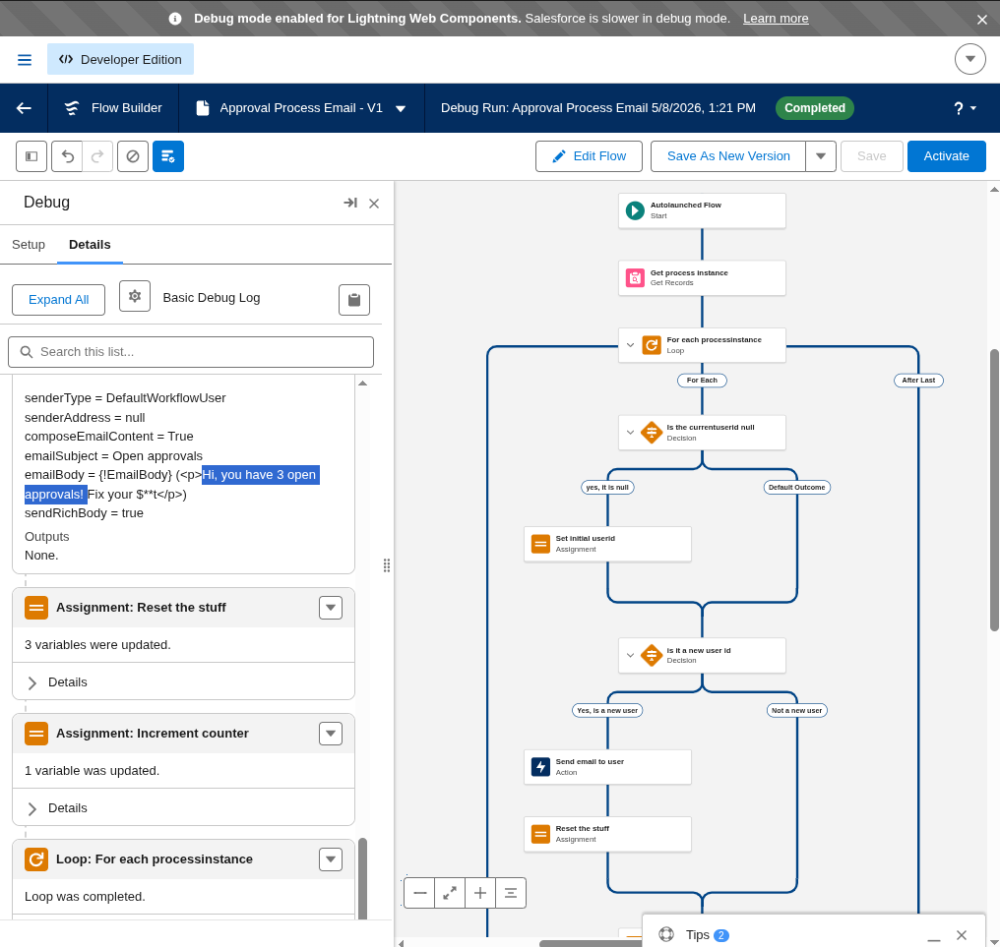

# Approval Process Email Flow

Built during Military Trailblazer Office Hours — 2026-05-08

## What It Does

This auto-launched Flow queries all open approval requests (`ProcessInstanceWorkitem`), groups them by approver, and sends each approver a single email summarizing how many pending approvals they have.

## Flow Logic

1. **Get process instances** — Queries up to 20,000 `ProcessInstanceWorkitem` records sorted by `ActorId` so approvals are naturally grouped per user.
2. **Loop** — Iterates through each workitem in ascending order.
3. **Track current user** — On the first record, sets the working user ID and email. On subsequent records, checks whether the actor has changed.
4. **Count** — Increments a counter for each workitem belonging to the current approver.
5. **Send email** — When a new approver is detected (user ID changes), sends the previous approver an HTML email with their pending count, then resets the counter and starts tracking the new user.

> **Known gap:** The last approver in the collection does not receive an email. The send is triggered only when the user *changes*, so the final group is never flushed.

## Files

| File | Purpose |
|------|---------|
| `force-app/main/default/flows/Approval_Process_Email.flow-meta.xml` | Flow metadata |

## Status

**Draft** — Not validated for production use at scale. Intended as a learning/demo example.

## Key Variables

| Variable | Type | Purpose |
|----------|------|---------|
| `currentuserid` | String | Tracks the approver being counted |
| `currentuseremailaddress` | String | Email address of the current approver |
| `currentcounter` | Number | Running count of open approvals for the current approver |

## Email

- **Subject:** `Open approvals`
- **Body:** `Hi, you have {count} open approvals! Fix your $**t`
- **Sender type:** Default Workflow User
- **Format:** HTML (rich body)

## Debug Run

Successful debug run from office hours (5/8/2026), showing the flow completing with 3 open approvals found for a user.

